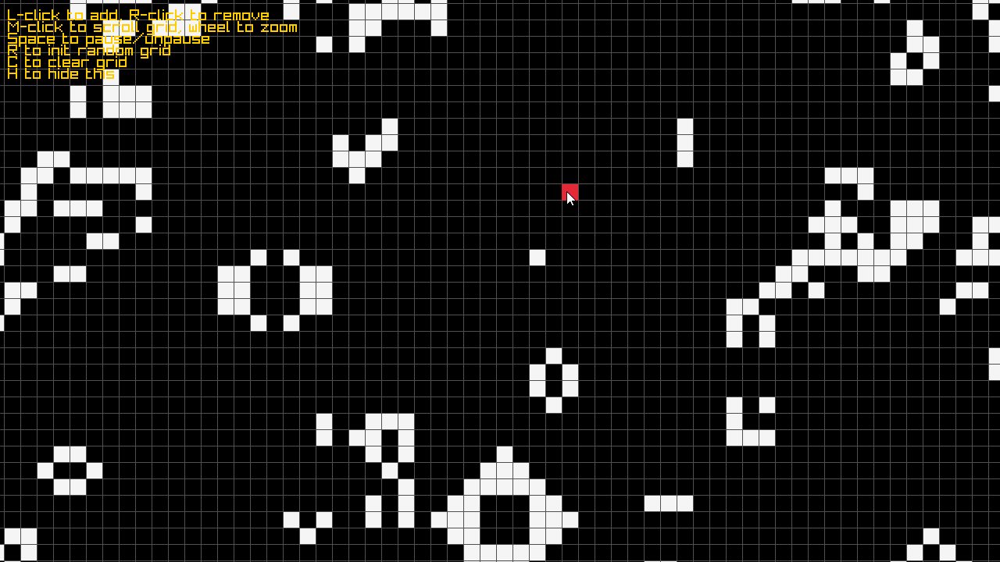

# Keys
- <kbd>Space</kbd> Pause/Unpause
- <kbd>Left Click</kbd> Add live cells
- <kbd>Right Click</kbd> Remove live cells
- <kbd>Middle Click + scroll</kbd> Scroll grid
- <kbd>Mouse wheel </kbd> Zoom in/out
- <kbd>R</kbd> Reset grid
- <kbd>C</kbd> Clear grid
- <kbd>H</kbd> Hide keys hint



# Build
This project depends on [raylib](https://github.com/raysan5/raylib).

To build and run:
```bash
  make dev
```

To simply build the executable:
```bash
  make prod
```